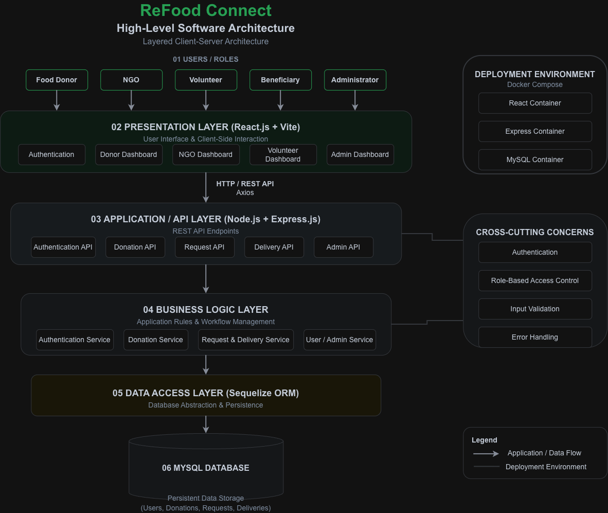

<div align="center">
  <h1>🍃 ReFood Connect</h1>
  <p><b>Smart Food Waste Redistribution Platform</b></p>
  
  
  
  
  
  
</div>

---

## 📖 Project Overview
**ReFood Connect** is a comprehensive, role-based web application engineered to bridge the gap between food surplus and food scarcity. By seamlessly connecting food donors (restaurants, hotels, bakeries) with NGOs and volunteers, the platform ensures that perfectly good, edible food reaches those in need rather than ending up in landfills.

## ✨ Key Features & User Roles

Our platform provides customized dashboards and capabilities for four distinct user roles:

* **🍱 Food Donors:** Can easily log surplus food batches, set pickup timeframes, and track the journey of their donation.
* **🏢 NGOs / Food Banks:** Can browse available donations in their area, request bulk pickups, and coordinate distribution to beneficiaries.
* **🚗 Volunteers:** Can view active delivery requests, claim transit routes, and update the status of the food delivery in real-time.
* **🛡️ Administrators:** Have full system oversight, capable of managing user verifications, system metrics, and resolving disputes.

---

## 🏗️ Software Design & Architecture (DA-2)

The ReFood Connect platform utilizes a **Layered Client-Server Architecture** (MVC-inspired) to ensure a strong separation of concerns. 

* **High Cohesion & Low Coupling:** We isolated business rules into a dedicated `Service` layer, ensuring our Express controllers remain lightweight. The React frontend is entirely decoupled, communicating purely via RESTful Axios endpoints.
* **Database Abstraction:** We integrated the **Sequelize ORM** to abstract complex SQL queries, vastly improving code security and developer velocity.

<div align="center">
  
  <p><i>Figure: High-Level Client-Server Architecture</i></p>
</div>

*(Note: Detailed Figma UI Mockups and further design specifications can be found in the [`/docs/Software_Design_Document.md`](./docs/Software_Design_Document.md) file).*

---

## 💻 Technology Stack

| Category | Technologies Used |
| :--- | :--- |
| **Frontend** | React.js (Vite), Tailwind CSS, Lucide Icons |
| **Backend** | Node.js, Express.js |
| **Database** | MySQL, Sequelize ORM |
| **DevOps** | Docker, Docker Compose |
| **Design** | Figma, Draw.io (Diagrams.net) |

---

## 🚀 Quick Start – Local Development

We have fully containerized the application using Docker to eliminate "it works on my machine" issues. You can spin up the entire database, backend API, and frontend client with a single command.

### 1. Clone the Repository
```bash
git clone https://github.com/ChiragAsija1323/ReFood-Connect.git
cd ReFood-Connect
```

### 2. Build and Start the Containers
```bash
docker compose up --build
```

### 3. Access the Application
* **Frontend UI:** `http://localhost:5173`
* **Backend API:** `http://localhost:8000`

---

## 📂 Project Structure

```text
ReFood-Connect/
├── client/                 # React.js Frontend Application
├── server/                 # Node.js / Express.js Backend API
├── design/                 
│   ├── diagrams/           # Draw.io Architecture Source & PNGs
│   └── wireframes/         # Figma UI Mockups (Login, Dashboards, etc.)
├── docs/                   # Software Engineering Documents (DA-1 & DA-2)
├── docker-compose.yml      # Multi-container orchestration
└── README.md               
```

---

## 👥 Contributors

This project was developed for the **Software Engineering (BCSE301L)** course at **VIT Chennai** by:

* **Chirag Asija** (24BDS1073)
* **Saanvi Gupta** (24BDS1023)

<br>
<p align="center"><i>"Minimizing waste, maximizing impact."</i></p>
